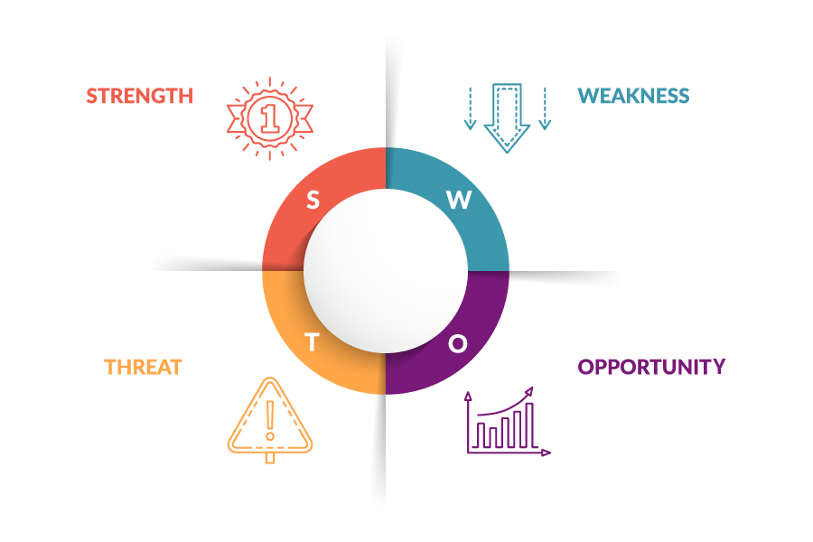

<!-- Frank -->

<!-- 
_class: title
-->

# SWOT Analysis - An overview

**By:** Dan Tran, Atsuya "Harry" Shimokawa, Bibek Dumre and Xinshun "Frank" Xu

---

# SWOT Attributes

<!-- Dan -->

Factor groups:

- **Internal**: Directly controllable

- **External**: Not directly controllable, but can be managed to some extent

Summary:

|  | Internal | External |
|---|---|---|
| **Beneficial** | **S**trengths | **O**pportunities |
| **Harmful** | **W**eaknesses | **T**hreats |

---

# Properties

<!-- Dan -->

- Strategic **planning technique**
- Provides **assessment tools**
- Purpose:
  - **Evaluate position** of individual or organization
  - Provide **insights** into internal and external factors
  - Inform **decision-making**
  - Identify **areas for improvement**

---

# **S**trengths

<!-- Bibek & Harry -->

- The company’s advantages over competitors.
- **Starbucks' case study**:
  - **Global Brand Recognition:** Renowned worldwide, providing a competitive edge.
  - **Unique Coffee Experience:** Distinctive ambiance, free Wi-Fi, and premium services.
  - **Global Presence:** Extensive network of outlets across continents.
  - **Robust Supply Chain:** Strategic supplier selection ensures high-quality coffee.

---

# **W**eaknesses

<!-- Bibek & Harry -->

- Areas where the company lags behind
- **Starbucks' case study**:
  - **Uniform Product Offering:** Lacks customization to local tastes.
  - **Premium Pricing:** May deter customers in less affluent markets.
  - **High Employee Turnover:** Potentially impacts service quality.

---

# **O**pportunities

<!-- Bibek & Harry -->

- External growth or improvement areas.
- **Starbucks' case study**:
  - **Market Expansion:** Potential growth in new and emerging markets.
  - **Entertainment Partnerships:** Enhance brand visibility and engage customers.
---

# **T**hreats

<!-- Bibek & Harry -->

- Addresses risks to the company’s operation
- **Starbucks' case study**:
  - **U.S. Market Saturation:** High density of stores limits growth potential.
  - **Health Trends:** Growing preference for healthier options could reduce demand.

---

# Limitations of SWOT

<!-- Frank -->

- **Subjective** nature: Based on personal opinions
- **Over-simplification**: Grossly generalizes complex issues
- **Lack of prioritization**: Does not rank factors by importance
- **No clear action plan**: Needs to integrate to strategic planning

Can be complimented by other [analytical tools](https://www.brainvire.com/blog/analytical-tools/), like: 
- SCRS (Strengths, Challenges, Resources, Solutions)
- MOST (Mission, Objectives, Strategies, Tactics)
- PEST (Political, Economic, Social, Technological)