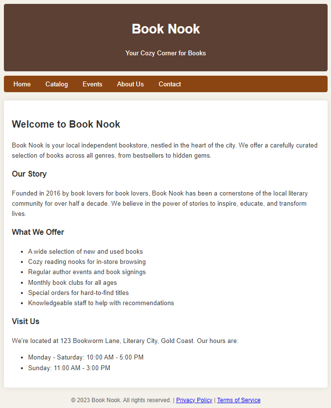

<!-- 
_class: title bg-gradient
footer: '**QIBA - Module 6** Professional Performance'
-->

# Module 6: Professional Performance

**Team:** Dan, Frank, Harry, Yuan

<!-- 
footer: ""
-->

<!-- # Purpose & Overview of the Assessment

- Teams are given a project to be completed over several weeks.
- Facilitators provide time during class sessions for teams to have weekly discussions and work towards a solution to a scenario problem.
- Each group submits an Ideas Brief and a Team Performance Report (Assessment Task 1).
- Each team member reflects on their individual performance through an Individual Participation and Reflection Report (Assessment Task 2).
- While the facilitator is available for advice and direction, teams are expected to manage themselves.
- Limited time is given in class to complete the project, with additional work expected outside of class.

---

# The Scenario: Project "Turnaround"

- You and other recent international graduates have established a **small business advisory company**.
- Your business provides innovative and profitable advice to businesses in your local area.
- **Local Books Bookstore Pty Ltd** is your first customer.
- They are seeking your advice and ideas on how to turnaround their failing business.

--- -->

---

# Our Team

**Dan** ***Project Manager*** Background in IT, experience in project management

**Harry** ***Accountant*** Background in finance, experience in accounting and legal

**Yuan** ***Business Analyst*** Background in business, experience in data analysis

**Frank** ***Marketing Coordinator*** Background in marketing, experience in digital marketing

---

# Our Client - Book Nook

- Located in a <mark class='highlight'>suburban shopping centre</mark>
- Profits and sales have <mark class='highlight'>dropped drastically</mark> in the <mark class='highlight'>last three years</mark>
- Facing the possibility of significant loss and <mark class='highlight'>potential bankruptcy</mark>
- <mark class='highlight'>3 full-time staff</mark> and <mark class='highlight'>5 casual staff</mark>
- Unable to <mark class='highlight'>compete on price</mark> with online booksellers
- <mark class='highlight'>Limited marketing efforts</mark> through <mark class='highlight'>paid advertisements</mark> and <mark class='highlight'>monthly catalogues</mark>
- Has <mark class='highlight'>simple website</mark> with basic information about the store

---

<!-- 
_class: title
-->

# Current Situation

---

# Book Nook SWOT Analysis

**Strengths** Local presence  Good location Physical store

**Weaknesses** Limited online presence Limited marketing High prices

**Opportunities** Local community Online presence Partnerships

**Threats** Reduced profits Bankruptcy Loss of jobs

---

# Why customers choose Book Nook

Popular amongst <mark class='highlight'>older customers</mark> who:

- Likes reading **hard copies**
- Supports **local** businesses
- Lives **nearby**
- Explores **gifting** options
- Wants to **educate** their children

Has a small community of <mark class='highlight'>loyal customers</mark> who:

- Regularly **visit the store**
- **Recommend** the store to friends
- **Subscribe** to the monthly catalogue

---

# Human Resources

**Full-time**: ~$80,000/year average (inc. super, leave, bonuses)

**Manager** Make executive decisions, manage staff

**Inventory Manager** Manage stock levels, orders

**Admin** Manage accounts, payroll

**Casual**: ~$25/hour

**Marketing Coordinator (1d / week)** Handle marketing efforts

**Digital Marketer (1d / week)** Manage online presence

**3x Storekeepers (alternate shifts + 5d)** Stock shelves, assist customers, cashier

---

# Financial Situation

<small>

| Expense | Description | Cost p.a., as of 2023 |
| --- | --- | --- |
| **Full-time wages** | 3 staff, $80,000 each (full package) p.a. | $240,000 |
| **Casual wages** | 5 staff, $25/hour | $70,000 |
| **Rent** | Shopping centre store-front, 150m²; $3,000/month | $36,000 |
| **Utilities** | Electricity, water, internet, $200/month | $2,400 |
| **Operation** | Stock, advertisements, $1,000/month | $12,000 |

</small>

<mark class='highlight'>Expenses</mark>: From table above: $\quad\$360,000 \text{ p.a.}$

<mark class='highlight'>Income</mark>: ~35 books/day at $20 each: $\quad\$245,000 \text{ p.a.}$

<mark class='highlight'>Loss</mark>: $\$115,000$ in 2023; ~$\$400,000$ since 2020 from $\$550,000$ initial budget.

<mark class='highlight'>Projected bankruptcy EOFY 2025</mark>.

---

# Competitors

Mostly <mark class='highlight'>Online Retailers</mark>, e.g., Amazon, Booktopia, etc:

- **Wider selection** of products to choose from
- **Convenience** of online shopping
- **Lower prices** due to bulk purchasing from worldwide suppliers
- **Better shopping experience** with recommendations, shopping history
- **Easy payment** options (card, PayPal, etc.)
- **Lower operation costs**, no physical store, fewer staff

Some customers <mark class='highlight'>read in store</mark> but <mark class='highlight'>buy online</mark> at a different retailer for cheaper prices.

- **No policy** to prevent this

---

# Marketing Efforts

<mark class='highlight'>Limited</mark>:

- Local newspapers advertisements
- Monthly catalogues new books

<mark class='highlight'>Simple website</mark> with basic information: [Book Nook](https://autumnssuns.github.io/qiba-docs/book-nook-site)

- **Store location** and **trading hours**
- **Doesn't function** properly
- No **online store**

<mark class='highlight'>Cannot reach young customers</mark>

