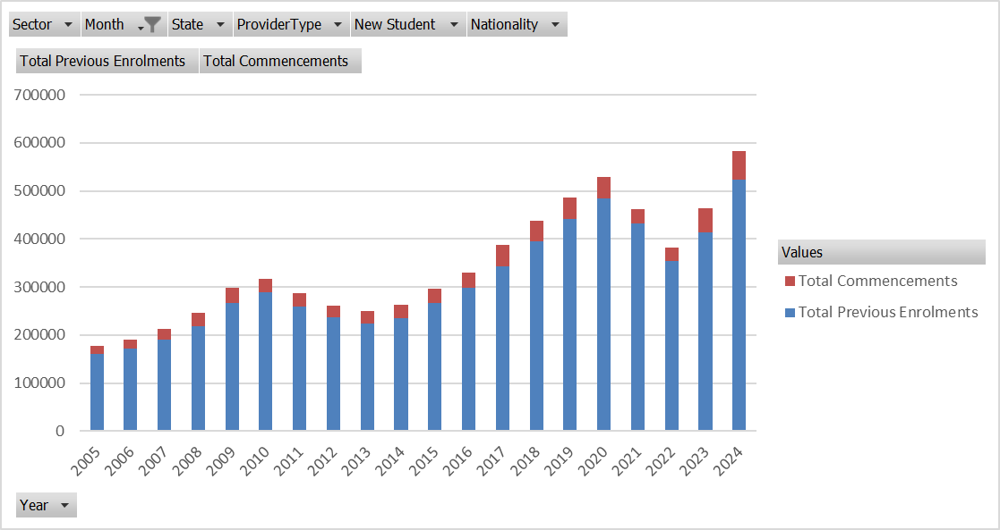
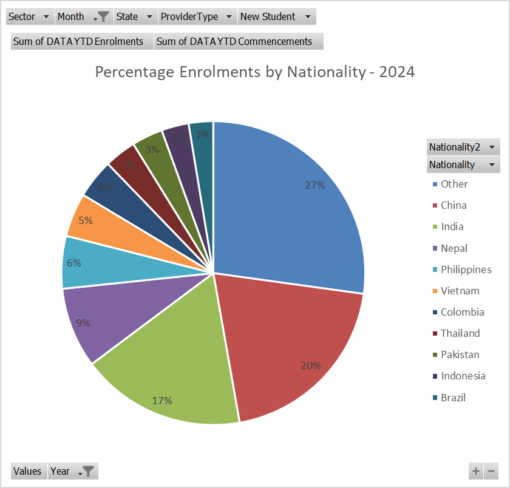
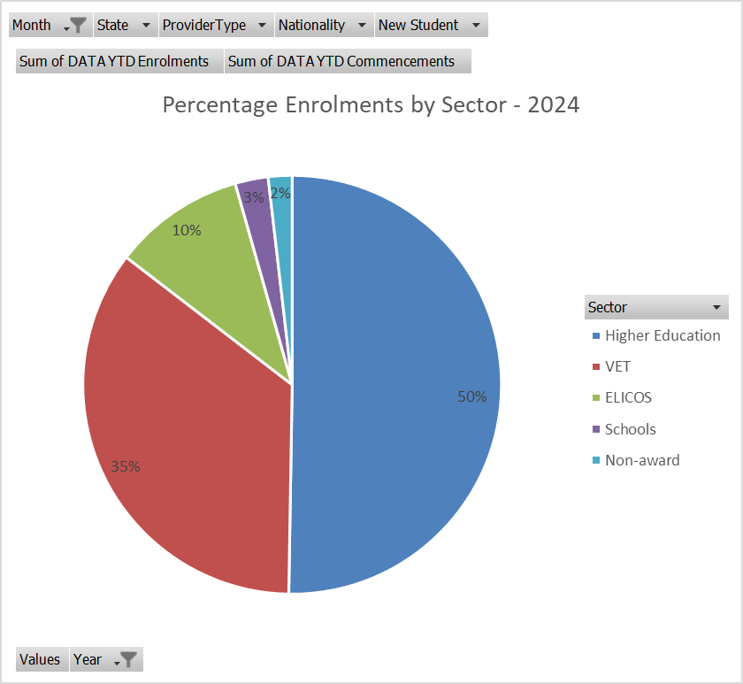

# PY Reporting to Manager

## Scenario

At a project team meeting this week, the Director, Digital Research and Design, Mel Wisdom, mentioned that the organisation is investigating the Australian Education Market. Based on their research and subsequent inferences, Nickel-Byte Pty Ltd aims to design and launch a nationwide mobile and web application that can link **users/customers** (both international education providers and individual international students) with the latest information, experiences and services of **owners/sponsors** (Australian businesses and government departments of interest to the international student market).

One example use would be: advertising casual, short term employment for international students with a work permit. Or international students offering their labour skills per hour and location. Another example would be: listing cafes and accommodation with special discounts for international students. “Cheapest coffee today in Brisbane CBD’. Newly arrived students would also be interested in tourism discounts and up to date public transport information. Government departments could use the app to update international students about new regulations.

Mel mentioned that this proposed app is still at an early concept stage and the go ahead or ultimate design features of the app will largely depend on further information to be gathered. Mel asked you and another project team member (both of international student background) to do a feasibility study into the potential usefulness and viability of such a mobile application.

Mel Wisdom has given a 2 week timeframe for this feasibility study and wants a verbal progress report in one week’s time.

### Summary

**Project**: Design and launch a nationwide mobile and web application for the Australian Education Market.

**Organization**: Nickel-Byte Pty Ltd

**Project Director**: Mel Wisdom

**Objective**: Link **users/customers** (international education providers and individual international students) with the latest information, experiences, and services of **owners/sponsors** (Australian businesses and government departments).

**Potential Features**:

| Feature | Target User | Description |
| --- | --- | --- |
| Employment Ads | Business Owners | Advertise casual, short-term employment for international students with a work permit. |
| Skill Offerings | International Students | International students can offer their labour skills per hour and location. |
| Discounts | Hospitality Services owners | List cafes and accommodations with special discounts for international students. |
| Tourism and Transport | Newly Arrived Students | Provide tourism discounts and up-to-date public transport information. |
| Regulatory Updates | Government departments | Government departments can update international students about new regulations. |

**Current Stage**: Early concept stage. The go-ahead or ultimate design features will depend on further information to be gathered.

**Task**: Conduct a feasibility study into the potential usefulness and viability of the proposed application.

**Team for Feasibility Study**: You and another project team member (both of international student background)

**Timeframe**: 2 weeks for the feasibility study with a verbal progress report due in one week.

# Research Information

## Dan - Information critical to Sponsors and Owners

In the scenario provided, the critical information for business owners and sponsors would likely include:

1. **Market Analysis**: Understanding the size, trends, and growth potential of the Australian Education Market is crucial. This includes the number of international students in Australia, their spending patterns, and the types of services they seek. [Austrade’s Education Data and Insights can provide valuable market overviews and data1](https://education.austrade.gov.au/)[2](https://education.austrade.gov.au/markets).
2. **User Needs and Behaviours**: Insights into international students’ challenges, such as cost of living, employment opportunities, and social integration needs. [This information can be gathered from recent studies and news articles highlighting the experiences of international students in Australia3](https://www.abc.net.au/news/2023-02-18/treatment-for-international-students-after-covid/101964512).
3. **Competitive Landscape**: Information on existing apps and services targeting international students. [This includes their features, user base, and the gaps they may have, which the new app could fill](https://education.austrade.gov.au/)[4](https://ftp.aeccglobal.com.au/blog/11-compelling-mobile-apps-for-students-studying-overseas).
4. **Regulatory Environment**: Knowledge of government regulations that affect international students, such as work rights, visa conditions, and education services standards. [This ensures the app complies with legal requirements and provides accurate information to users5](https://www.education.gov.au/esos-framework/resources/international-students-factsheet)[6](https://internationaleducation.gov.au/Regulatory-Information/Pages/Information-for-Students.aspx).
5. **[Business Engagement**: Data on how Australian businesses currently engage with international students, including marketing strategies, employment opportunities, and the benefits they seek from this demographic7](https://broadenourhorizons.com.au/employers/).
6. **Technology Trends**: Current technological trends and innovations that could influence the design and functionality of the app, ensuring it meets modern standards and expectations.
7. **Risk Assessment**: Potential risks, including financial, operational, and reputational risks associated with targeting the international student market. [This also involves understanding scams targeting international students and measures to protect users](https://education.austrade.gov.au/)[8](https://rgit.edu.au/digital-scams-targeting-international-students-in-australia/).
8. **Revenue Model**: Possible revenue streams for the app, such as advertising, premium features, or partnerships with Australian businesses and government departments.
9. **Stakeholder Feedback**: Gathering input from potential users and sponsors through surveys, interviews, or focus groups to validate the concept and refine the app’s features.
10. **Pilot Testing**: Strategies for testing the app with a small user base before a full-scale launch to gather initial feedback and make necessary adjustments.

This feasibility study would involve a combination of desk research, stakeholder interviews, surveys, and analysis of secondary data. The goal is to provide a comprehensive overview of the opportunity, backed by data and insights that can inform the decision-making process for the app’s development and launch. The progress report in one week should summarize the initial findings and outline the next steps for the remaining study period.

## Harry - Information critical to Customers and Users

For customers or users, which in this scenario are international students, the critical information would include:

1. **Ease of Use**: The app should have an intuitive design that is easy to navigate. [International students may be using such an app for the first time, so a user-friendly interface is essential1](https://www.ramotion.com/blog/mobile-app-engagement/).
2. **[Language Support**: Considering language barriers, the app should support multiple languages or have features like in-app translation to help non-native English speakers understand and use the app effectively](https://www.ramotion.com/blog/mobile-app-engagement/)[2](https://www.torrens.edu.au/stories/blog/international/10-challenges-every-international-student-faces).
3. **[Cultural Sensitivity**: The app should be culturally inclusive, providing content and services that are relevant and respectful to the diverse backgrounds of international students](https://www.ramotion.com/blog/mobile-app-engagement/)[3](https://www.pfecglobal.com.au/top-7-challenges-for-international-students-who-study-in-australia/).
4. **[Employment Opportunities**: Information on casual and part-time job listings that are compatible with student visa work restrictions would be highly valued by users looking to support themselves financially while studying1](https://www.ramotion.com/blog/mobile-app-engagement/).
5. **[Discounts and Deals**: Features that offer exclusive discounts and deals on food, accommodation, and tourism, tailored to the budget constraints of students, would likely attract users1](https://www.ramotion.com/blog/mobile-app-engagement/).
6. **[Educational Content**: Providing educational resources, tips, and tools for academic success could be a significant draw for students looking to enhance their learning experience1](https://www.ramotion.com/blog/mobile-app-engagement/).
7. **[Social Integration**: Tools for social networking and community building can help international students connect with peers, join clubs, and integrate into the local culture](https://www.ramotion.com/blog/mobile-app-engagement/)[2](https://www.torrens.edu.au/stories/blog/international/10-challenges-every-international-student-faces).
8. **[Safety and Security**: Features that ensure user safety, such as secure login, privacy controls, and information on local emergency services, would be important to users1](https://www.ramotion.com/blog/mobile-app-engagement/).
9. **[Real-Time Updates**: The app should provide real-time updates on public transport, new regulations, and other critical information that impacts the daily life of students1](https://www.ramotion.com/blog/mobile-app-engagement/).
10. **[Feedback Mechanism**: A system for users to provide feedback on the app’s features and services can help the developers make necessary improvements and updates1](https://www.ramotion.com/blog/mobile-app-engagement/).
11. **[Offline Accessibility**: Considering that students may not always have internet access, the ability to use certain features of the app offline would be beneficial1](https://www.ramotion.com/blog/mobile-app-engagement/).
12. **[Cost**: The app should be affordable or free for students, as this demographic often has limited financial resources1](https://www.ramotion.com/blog/mobile-app-engagement/).

These elements would not only make the app more appealing to international students but also ensure that it meets their specific needs and preferences. The feasibility study should explore these aspects through user surveys, interviews, and market research to determine the app’s potential success and impact.

[https://www.abs.gov.au/](https://www.abs.gov.au/)

[International Education Data and Research - Department of Education, Australian Government](https://www.education.gov.au/international-education-data-and-research)

## Feasibilities

### Consideration 1: Who are the **main customers/users** of the app and what are **their requirements**?

The main customers/users of the app are international students in Australia. Their requirements can be identified through a combination of statistical data and qualitative insights:

1. **Statistical Data**:
    - **[Student Numbers**: As of January 2024, there were **582,636 enrolments** by international students in Australia1](https://www.education.gov.au/international-education-data-and-research/international-student-monthly-summary-and-data-tables).
    - **[Demographics**: The top five source countries for these students are China (20%), India (17%), Nepal (9%), Philippines (6%), and Vietnam (5%)1](https://www.education.gov.au/international-education-data-and-research/international-student-monthly-summary-and-data-tables).
    - **[Qualifications and Categories**: Information on the types of qualifications sought by these students, such as vocational education and training (VET), higher education, English Language Intensive Courses for Overseas Students (ELICOS), etc., is essential1](https://www.education.gov.au/international-education-data-and-research/international-student-monthly-summary-and-data-tables).
    - **[New Arrivals**: Tracking the number of new international student arrivals each year helps in understanding market growth and needs1](https://www.education.gov.au/international-education-data-and-research/international-student-monthly-summary-and-data-tables).
2. **Qualitative Insights**:
    - **Focus Groups**: Conducting focus groups with international students, such as those in your PY class, can provide direct feedback on their needs and preferences.
    - **[Wellbeing Reports**: Government and institutional reports on international student wellbeing can offer insights into the challenges and requirements of this demographic2](https://internationaleducation.gov.au/International-network/Australia/InternationalStrategy/EGIProjects/Documents/ORYGEN%20-%20International%20Student%20Mental%20Health%20and%20Physical%20Safety%20June%202020.pdf)[3](https://www.education.gov.au/student-resilience-and-wellbeing/australian-student-wellbeing-framework)[4](https://internationaleducation.gov.au/News/Latest-News/Pages/Report-on-International-Students%E2%80%99-Mental-Health-and-Physical-Safety-.aspx).

By combining this data with feedback from potential app users and stakeholders, you can establish a clear picture of the main customers/users and their specific requirements. This will inform the development of the app to ensure it aligns with the needs of international students in Australia.

### Consideration 2:  Which topics and content will become the **main features of the app**?

Based on the findings from the investigation into the needs of international students in Australia, as well as insights from popular apps and services, the main features of the app could include:

1. **[Job Listings**: A platform for advertising casual and short-term employment opportunities that are compatible with student visa work restrictions1](https://study.uq.edu.au/stories/best-apps-students).
2. **[Discounts and Deals**: A feature for local businesses to list special offers, such as the “cheapest coffee today in Brisbane CBD,” catering to the budget-conscious student demographic1](https://study.uq.edu.au/stories/best-apps-students).
3. **[Accommodation Services**: A service to help students find affordable housing options, including shared accommodations and short-term leases1](https://study.uq.edu.au/stories/best-apps-students).
4. **[Public Transport Information**: Real-time updates and navigation assistance for public transport systems across various Australian cities1](https://study.uq.edu.au/stories/best-apps-students).
5. **[Educational Resources**: Tools for academic support, such as study tips, referencing help, and language translation services1](https://study.uq.edu.au/stories/best-apps-students).
6. **[Social Networking**: Features to help students connect with peers, join clubs, and participate in community events, enhancing their social integration1](https://study.uq.edu.au/stories/best-apps-students).
7. **[Marketplace**: A space where students can offer their labor skills per hour and location, and where they can buy, sell, or exchange goods within the student community1](https://study.uq.edu.au/stories/best-apps-students).
8. **[Cultural Integration**: Information on local customs, slang, and cultural norms to help international students acclimate to life in Australia1](https://study.uq.edu.au/stories/best-apps-students).
9. **[Health and Wellbeing**: Access to mental health resources, fitness tracking, and information on local healthcare services1](https://study.uq.edu.au/stories/best-apps-students).
10. **[Legal and Regulatory Updates**: Notifications about changes in regulations that affect international students, such as visa conditions and work rights1](https://study.uq.edu.au/stories/best-apps-students).
11. **[Emergency Services**: Quick access to emergency contacts and safety information, including campus-specific safety measures1](https://study.uq.edu.au/stories/best-apps-students).
12. **[Personal Finance Management**: Budgeting tools and financial literacy resources tailored to the needs of international students1](https://study.uq.edu.au/stories/best-apps-students).

These features are designed to address the current needs and enhance the overall experience of international students in Australia, making their transition and stay more comfortable and informed. The app’s content and topics should be regularly updated based on user feedback and changing market dynamics to remain relevant and useful.

### Consideration 3: Who are the **main owners/sponsors** of the app and what benefits will they derive (return on investment)?

The main owners/sponsors of the app are likely to be local businesses, service providers, employers, accommodation agents, and possibly government departments that are interested in reaching and serving the international student market in Australia. The benefits they can expect to derive from their investment in the app include:

1. **[Increased Visibility**: By featuring on the app, sponsors can increase their brand exposure to a targeted audience of international students1](https://tinyscreenlabs.com/mobile-app-sponsorship/).
2. **[Direct Marketing**: The app provides a direct channel to promote products, services, and job opportunities to international students who are actively seeking such information](https://tinyscreenlabs.com/mobile-app-sponsorship/)[2](https://mobileup.io/realize-the-possibilities-of-in-app-sponsorships/).
3. **[Brand Association**: Sponsors can enhance their brand image by associating with an app that supports the educational sector and international students, showcasing their commitment to community support1](https://tinyscreenlabs.com/mobile-app-sponsorship/).
4. **[Data Insights**: Sponsors can gain valuable insights from user data collected through the app, which can inform future marketing strategies and product development](https://tinyscreenlabs.com/mobile-app-sponsorship/)[2](https://mobileup.io/realize-the-possibilities-of-in-app-sponsorships/).
5. **[Competitive Advantage**: Being early sponsors of the app could give businesses a first-mover advantage in the international student market](https://tinyscreenlabs.com/mobile-app-sponsorship/)[3](https://www.sponsorunited.com/sponsorship-101/six-key-benefits-of-sponsorships).
6. **[Customer Engagement**: The app can facilitate engagement with international students, fostering loyalty and potentially leading to word-of-mouth referrals](https://tinyscreenlabs.com/mobile-app-sponsorship/)[3](https://www.sponsorunited.com/sponsorship-101/six-key-benefits-of-sponsorships).
7. **Return on Investment (ROI)**: Sponsors will look for a positive ROI, which could be in the form of increased sales, customer acquisition, or brand equity. [Many brands aim for a 2:1 or higher ROI ratio for their sponsorship investments](https://tinyscreenlabs.com/mobile-app-sponsorship/)[4](https://www.eventbrite.com/blog/sponsorship-roi-ds00/).

To record opinions and gauge the appetite for the proposed app among potential sponsors, a survey tool can be very useful. There are several online survey tools available that can help collect this data efficiently. [Some popular options include Google Forms, SurveyMonkey, and Typeform, which offer a range of features for creating and distributing surveys to gather feedback](https://tinyscreenlabs.com/mobile-app-sponsorship/)[5](https://www.surveymanager.com.au/blog/the-11-best-online-survey-tools-in-australia-for-gathering-data-and-feedback/)[6](https://blog.hubspot.com/service/survey-software)[7](https://zapier.com/blog/best-survey-apps/)[8](https://zight.com/blog/online-survey-tools/)[9](https://www.capterra.com/resources/top-survey-software/). These tools can help you design a questionnaire that captures the perspectives of potential sponsors on the app’s concept, features, and potential benefits for their businesses.

### Consideration 4: Is the app useful enough to attract **payment** from the user? From the sponsor? Subscription fee?

Determining the app’s potential to attract payment from users and sponsors, and whether a subscription fee is viable, involves several factors:

1. **Value Proposition**: The app must offer significant value to users, such as unique features or services that are not readily available elsewhere. [This could include exclusive job listings, discounts, or educational content tailored to international students1](https://medium.com/technology-buzz/app-monetization-strategies-from-freemium-to-subscription-models-0d7430b82163).
2. **Market Demand**: There needs to be a clear demand for the app’s services. [Market research and user feedback can help assess this demand and shape the app’s offerings to meet user needs](https://medium.com/technology-buzz/app-monetization-strategies-from-freemium-to-subscription-models-0d7430b82163)[2](https://www.amity.co/blog/20-app-monetization-stats-you-should-know).
3. **Competitive Pricing**: The pricing model must be competitive and align with what users are willing to pay. [Research shows that users are generally more inclined to pay for apps that offer high perceived value and usefulness3](https://www.emerald.com/insight/content/doi/10.1108/APJML-06-2019-0411/full/html).
4. **Sponsor Interest**: Sponsors will invest if they see a direct benefit, such as increased visibility or access to a niche market. [The app must demonstrate its reach and effectiveness in engaging international students](https://medium.com/technology-buzz/app-monetization-strategies-from-freemium-to-subscription-models-0d7430b82163)[4](https://blog.mimio.com/7-of-the-biggest-investors-in-ed-tech-why-it-matters-to-you).
5. **Monetization Strategy**: The app’s monetization strategy should be carefully crafted. Options include in-app advertising, freemium models, paid versions, and subscriptions. [Each has its own set of advantages and challenges that need to be considered1](https://medium.com/technology-buzz/app-monetization-strategies-from-freemium-to-subscription-models-0d7430b82163)[2](https://www.amity.co/blog/20-app-monetization-stats-you-should-know).
6. **User Experience**: The monetization model should not detract from the user experience. [Users are more likely to pay for apps that are user-friendly, reliable, and provide a seamless experience](https://medium.com/technology-buzz/app-monetization-strategies-from-freemium-to-subscription-models-0d7430b82163)[5](https://www.startechup.com/blog/9-app-monetization-strategies/).
7. **Sponsor ROI**: Sponsors will look for a return on investment, which could be in the form of increased sales, customer engagement, or brand loyalty. [The app needs to provide metrics or projections to demonstrate potential ROI](https://medium.com/technology-buzz/app-monetization-strategies-from-freemium-to-subscription-models-0d7430b82163)[6](https://mobileup.io/realize-the-possibilities-of-in-app-sponsorships/).
8. **Regulatory Compliance**: Especially for educational apps, compliance with regulations and data protection laws is crucial. [This can affect the app’s ability to monetize certain features or content](https://medium.com/technology-buzz/app-monetization-strategies-from-freemium-to-subscription-models-0d7430b82163)[7](https://www.elegantmedia.com.au/blog/10-ways-find-investors-for-your-app-idea-in-australia/).
9. **[User Feedback**: Early user testing and feedback can provide insights into the app’s usefulness and the willingness of users to pay for its services8](https://www.cccreative.design/blogs/how-much-are-users-willing-to-pay-for-app-subscriptions).
10. **[Sponsor Feedback**: Similarly, potential sponsors’ feedback can indicate their interest in investing in the app and the types of sponsorship or advertising models they prefer6](https://mobileup.io/realize-the-possibilities-of-in-app-sponsorships/).

While it is challenging to determine the app’s financial viability before development, these factors can guide the creation of a monetization strategy that appeals to both users and sponsors. Surveys, focus groups, and market analysis can provide the necessary data to make informed decisions about pricing and monetization models.

### Consideration 5: Can the app be funded from **paid advertising**? How would this be integrated?

Yes, the app can indeed be funded through paid advertising, and when integrated thoughtfully, it can be a significant source of revenue without being overly intrusive for users. Here’s how paid advertising can be integrated into the app:

1. **[Strategic Ad Placement**: Ads can be placed at natural stopping points within the app, such as between different sections or features, to minimize disruption to the user experience1](https://www.builder.ai/blog/in-app-advertising).
2. **[Targeted Advertising**: By leveraging user data, ads can be highly targeted to the interests and behaviors of the users, increasing the relevance and effectiveness of the ads1](https://www.builder.ai/blog/in-app-advertising).
3. **[Ad Formats**: A variety of ad formats can be used, such as banner ads, interstitial ads, video ads, and native ads, which can blend more seamlessly with the app’s content2](https://www.adjust.com/blog/the-complete-guide-to-in-app-advertising/).
4. **[User Engagement**: Interactive ad formats like playable ads or rich media can enhance user engagement, making the ads a part of the app experience rather than a distraction1](https://www.builder.ai/blog/in-app-advertising).
5. **[Frequency Capping**: Limiting the number of times an ad is shown to the same user can prevent ad fatigue and maintain a positive user experience1](https://www.builder.ai/blog/in-app-advertising).
6. **[Ad Customization**: Allowing users to set preferences for the types of ads they see can improve their experience and the effectiveness of the ads1](https://www.builder.ai/blog/in-app-advertising).
7. **[Incentivized Ads**: Offering rewards for watching ads, such as in-app currency or discounts, can make users more receptive to advertising2](https://www.adjust.com/blog/the-complete-guide-to-in-app-advertising/).
8. **[Quality Control**: Ensuring that the ads are of high quality and relevant to the app’s content can improve user perception and acceptance of the ads1](https://www.builder.ai/blog/in-app-advertising).

By carefully considering the user experience and the needs of the sponsors, paid advertising can be a win-win solution. Service providers and government agencies can benefit from targeted exposure, while the app can generate the necessary revenue to support its development and maintenance. The key is to strike the right balance between monetization and user satisfaction.

### Consideration 6: What is the **potential number of users nationally** and what uptake can we expect?

The potential number of users for the app, which targets international students in Australia, can be estimated based on the latest available data:

- [As of January 2024, there were **582,636 enrolments** by international students in Australia, incorporating enrolments carried over from 2023 and new commencements1](https://www.education.gov.au/international-education-data-and-research/international-student-numbers-country-state-and-territory)[2](https://www.education.gov.au/international-education-data-and-research/international-student-monthly-summary-and-data-tables).
- [The number of international student enrolments was **746,387** in December 2022, indicating that one student may enroll in more than one course](https://www.education.gov.au/international-education-data-and-research/international-student-numbers-country-state-and-territory)[3](https://www.studying-in-australia.org/international-students-in-australia-statistics/).

Considering these figures, the potential national user base for the app could be in the range of **582,636 to 746,387** international students, depending on the overlap of enrolments and individual students.

As for the uptake, it’s challenging to predict exact numbers before the app’s development and release. However, factors that can influence uptake include:

- **Market Need**: If the app addresses a significant need or gap in the market, uptake is likely to be higher.
- **Marketing and Promotion**: Effective marketing strategies can significantly boost initial uptake.
- **User Experience**: A positive user experience, including ease of use and valuable features, can lead to higher adoption rates.
- **Word of Mouth**: Recommendations from peers and user reviews can greatly influence uptake among international students.
- **Incentives**: Offering incentives for early adopters or for referrals can increase uptake.

For a new app, a conservative estimate for uptake in the first year might range from **5% to 10%** of the potential user base, provided the app is well-received and marketed effectively. This would translate to approximately **29,132 to 74,639** users in the first year, based on the potential user base numbers. These estimates should be refined with more specific market research and analysis as part of the feasibility study.

### Consideration 7: How can its popularity be further boosted?

Boosting the popularity of an app involves a multi-faceted approach that includes both organic and paid strategies. Here are some effective methods to consider:

1. **[App Store Optimization (ASO)**: Improve the app’s visibility in app stores by optimizing the title, description, keywords, and visuals to rank higher in search results1](https://www.businessofapps.com/insights/guide-to-app-growth-strategy/).
2. **Social Media Marketing**: Utilize social media platforms to create buzz around the app. [Share engaging content, run contests, and leverage influencers to reach a wider audience](https://www.businessofapps.com/insights/guide-to-app-growth-strategy/)[2](https://fliplet.com/blog/34-mobile-app-promotion-strategies/).
3. **[Content Marketing**: Develop valuable content such as blog posts, videos, and infographics that can attract users and encourage them to download the app](https://www.businessofapps.com/insights/guide-to-app-growth-strategy/)[3](https://apptile.com/blog/boost-your-apps-popularity-simple-ways-to-increase-downloads-and-build-a-devoted-community/).
4. **[User Reviews and Ratings**: Encourage users to leave positive reviews and ratings, which can improve the app’s credibility and attract new users](https://www.businessofapps.com/insights/guide-to-app-growth-strategy/)[2](https://fliplet.com/blog/34-mobile-app-promotion-strategies/).
5. **[Referral Programs**: Implement referral programs that reward users for inviting their friends to use the app, thus leveraging word-of-mouth marketing](https://www.businessofapps.com/insights/guide-to-app-growth-strategy/)[3](https://apptile.com/blog/boost-your-apps-popularity-simple-ways-to-increase-downloads-and-build-a-devoted-community/).
6. **[Email Marketing**: Use email campaigns to engage with potential users, provide updates, and offer exclusive deals to encourage app downloads](https://www.businessofapps.com/insights/guide-to-app-growth-strategy/)[2](https://fliplet.com/blog/34-mobile-app-promotion-strategies/).
7. **[Paid Advertising**: Invest in targeted ads on social media, search engines, and other platforms to reach potential users quickly1](https://www.businessofapps.com/insights/guide-to-app-growth-strategy/).
8. **[Partnerships and Collaborations**: Partner with other businesses or educational institutions to promote the app to their audiences](https://www.businessofapps.com/insights/guide-to-app-growth-strategy/)[2](https://fliplet.com/blog/34-mobile-app-promotion-strategies/).
9. **[Public Relations**: Get media coverage by reaching out to journalists, bloggers, and industry influencers to write about the app](https://www.businessofapps.com/insights/guide-to-app-growth-strategy/)[2](https://fliplet.com/blog/34-mobile-app-promotion-strategies/).
10. **[Events and Webinars**: Host events or webinars that can provide value to the target audience while promoting the app](https://www.businessofapps.com/insights/guide-to-app-growth-strategy/)[2](https://fliplet.com/blog/34-mobile-app-promotion-strategies/).
11. **[App Updates and Features**: Regularly update the app with new features and improvements to keep users engaged and attract new ones](https://www.businessofapps.com/insights/guide-to-app-growth-strategy/)[3](https://apptile.com/blog/boost-your-apps-popularity-simple-ways-to-increase-downloads-and-build-a-devoted-community/).
12. **[Localization**: Tailor the app to different markets by localizing the content, which can increase its appeal to a global audience2](https://fliplet.com/blog/34-mobile-app-promotion-strategies/).

By implementing these strategies and continuously evaluating their performance, you can significantly boost the app’s popularity and user base.

# Verbal Report Slide Content

# Feasibility Study of Nickle-Byte a new phone application projects

**By**: Dan Tran and Atsuya Shimokawa

# Project Background

**Project**: Design and launch a nationwide mobile and web application for the Australian Education Market.

**Organization**: Nickel-Byte Pty Ltd

**Project Director**: Mel Wisdom

**Objective**: Link **users/customers** (international education providers and individual international students) with the latest information, experiences, and services of **owners/sponsors** (Australian businesses and government departments).

# Sample Features

| Feature | Target User | Description |
| --- | --- | --- |
| Employment Ads | Business Owners | Advertise casual, short-term employment for international students with a work permit. |
| Skill Offerings | International Students | International students can offer their labour skills per hour and location. |
| Discounts | Hospitality Services owners | List cafes and accommodations with special discounts for international students. |
| Tourism and Transport | Newly Arrived Students | Provide tourism discounts and up-to-date public transport information. |
| Regulatory Updates | Government departments | Government departments can update international students about new regulations. |

# Current Progress and Future Tasks

**Current Stage**: Early concept stage. The go-ahead or ultimate design features will depend on further information to be gathered.

**Task**: Conduct a feasibility study into the potential usefulness and viability of the proposed application.

**Team for Feasibility Study**: You and another project team member (both of international student background)

**Timeframe**: 2 weeks for the feasibility study with a verbal progress report due in one week.

# User Classification

Two major groups, with different needs:

- Business or Services **Owners** and **Sponsors**
    - Increase **popularity**, and generate **revenue**
    - **Broadcast** information
    - **Analyse** market, workforce and business trends
- International Students (**Customers** / **Users**)
    - Find **information** (lifestyle, news, etc.)
    - Student **benefits**
    - **Opportunities** (employment, events, education)

# User Base - Customers and Users

International students in Australia:

- January 2024: 582,636 enrolments
- **Multi-culture**: China, India, Nepal, Philippines, Vietnam
- **Sectors**: Vocational Education and Training (VET), Higher Education, English Language Intensive Courses

Can track arrivals to better understand growth and needs.

# User Base - Business Owners and Sponsors

- Small and Medium-sized Enterprise:
- local businesses, service providers, employers
- Big Corporates 
- Finance, Insurance,
- Public Sector: 
-Some government departments,  Education agents, accommodation agents, Healthcare, Transport

# Interests - Customers and Users

Extremely wide range of interests:

- **Lifestyle**: Discounts and deals; Accommodation; Public transport; Marketplace; Healthcare; Emergency services; etc.
- **News**: Legal and regulatory updates
- **Employment**: Job-listings; Educational resources; Finance management

Not feasible to have **all-in-one** app.

local businesses, service providers, employers, accommodation agents, and possibly government departments that are interested in reaching and serving the international student market in Australia.

# Interests - Business Owners and Sponsors

Common business interests:

- **Marketing**: Increased visibility; Products / services promotion; Brand association
- **Analysis**: Data insights (number of users, education, employment data, etc.)
- **Engagement**: Gets feedback; Publish news

**Ultimate goal**: Positive Return on Investment (ROI) through increased sales, customer acquisition or brand equity

# Solution - Integration Hub

Inspired by **Centrelink**, provides an authentication system:

- Allows other services / product owners (c**lient**) to **integrate** their own app
- Users can connect using **social account** (Facebook, Google, etc.)
- Provides a **news platform** for each client

Business model:

- Yearly **subscription** for business owners and sponsors (for API access)
- **Free-of-charge for students**

# Potentials

Large user base:

- 582,636 enrolments as of Jan 2024
- Could **grow** or **decrease** year by year

Hard to predict uptake before development and release. Factors:

- Market needs and promotion strategies
- User experience
- Incentives for business owners (early adopters)

First year **conservative** estimate 5 - 10% of potential user base: 25 - 50k

# Popularity Boosting Strategies

Major categories:

- **Marketing**: Social media ads; Blogs and Videos & Referral Programs
- **Relationship Management**:
    - **Users**: Reviews and ratings; Events and Webinars
    - **Sponsors**: Partnership programs; Sharing feedback and insights; Success stories
- **Performance**: User-friendly & frequent updates

# Feasibility Study Report

<!-- It is essential that the following sections are incorporated in the report:
a.	Cover Page.
b.	Executive Summary
c.	Table of Content.
d.	Introduction and Conclusion.
e.	Evidence of research conducted, including graphical illustrations, charts, maps, where applicable.
f.	Methodical and structured analysis of the research completed.
g.	Creative, practical and viable recommendations, based on the above research and analysis.
h.	Details of references and the dates in which these sources were accessed.
 -->

## Cover Page

### Title

Feasibility Study of Nickel-Byte: A New Mobile and Web Application for the Australian Education Market

### What is the purpose of the report

The purpose of this feasibility study report is to assess the potential usefulness and viability of the proposed mobile and web application for the Australian Education Market. The report will provide insights into the target users, features, owners/sponsors, and revenue models of the app, as well as recommendations for its development and launch.

### Who is the report written for?

The report is written for the project director, Mel Wisdom, and other stakeholders involved in the development and launch of the app. It aims to inform decision-making by providing a comprehensive overview of the opportunity, backed by data and insights gathered during the feasibility study.

## Executive Summary

The feasibility study of a new mobile and web application for the international student market in Australia, has been conducted to assess its potential usefulness and viability. The study focused on the major customers/users of the app, the main features, owners/sponsors, revenue models, and strategies to boost its popularity. Key findings include: (1) the international student market in Australia is large and diverse, with significant interest in lifestyle, news, and employment opportunities; (2) local businesses, service providers, and government departments are potential owners/sponsors of the app, seeking increased visibility and engagement with international students; (3) it is not viable to have an all-in-one app, but an integration hub inspired by [Centrelink](https://www.servicesaustralia.gov.au/centrelink?context=1) could provide a solution; (4) potential revenue streams include subscriptions, paid advertising, and partnerships with businesses and government departments; (5) the app has the potential to attract a large user base, with conservative estimates suggesting 5-10% uptake in the first year; and (6) strategies to boost the app's popularity include marketing, relationship management, and performance improvements. The report concludes with recommendations for the app's development and launch to maximize its success.

## Introduction

<!-- Considerations:

- Why is the report being written?
- Written at the request of...
- How was the information obtained
- Outline
- And will conclude with recommendations as to

Include the purpose and context of the report. Include a definition of words that needs explanation. May include the methods of investigation.

 -->

The aim of this report is to present the research and analysis of a proposed mobile and web application for the Australian Education Market, specifically international students. The application is designed to connect users with the latest information, experiences, and services offered by local businesses and government departments, termed as **owners/sponsors**. This feasibility study is written for the project director, Mel Wisdom, and other stakeholders involved in the project to inform decision-making regarding the app's development and launch.

The information for this report was obtained through a feasibility study conducted by a team of two project members, focusing on the potential user base, features, revenue models, and strategies to boost the app's popularity.

Being at the early concept stage, this study will begin with an overview of the main customers / users of the app and their requirement, followed by the main features of the app, the main owners/sponsors, and the benefits they will derive. The report will also explore the potential for the app to attract payment from users and sponsors, the feasibility of funding through paid advertising, and the potential number of users nationally and expected uptake. It will conclude with recommendations for the app's development and launch in order to boost its popularity and maximize its success.

## The International Student Market in Australia

### Statistical Data

The main customers/users of the app are international students in Australia, who have a diverse range of needs and preferences in all aspects of their daily life. Before diving into the specific requirements of these users, it is essential to understand the market size and composition of international students in Australia through statistical data, obtained from the Department of Education, Australian Government.

Firstly, the following bar chart illustrates the trend of international student enrolments in Australia over the past few years:

It is evident that the number of international student experienced a decline in 2021 due to the COVID-19 pandemic, but has been steadily increasing since then, reaching historic highs in 2024 with 582636 enrolments (including an all-time high of 59233 new commencements in January 2024). This is a significant market size that presents a valuable opportunity for the proposed app.

In terms of the demographic composition, the following pie chart shows the top ten source countries for international students in Australia, with other countries grouped under "Other":

It can be seen that China (20%), India (17%), Nepal (9%), Philippines (6%), and Vietnam (5%) are the top five source countries for international students in Australia, accounting for 57% of the total enrolments. This diversity in nationalities highlights the need for an app that caters to the unique needs and preferences of students from various cultural backgrounds.

Finally, to have a better understanding of their lifestyle and preferences, the following pie chart shows the distribution of international student enrolments by sector:

Amongst the five sectors, Higher Education is the most popular choice for international students, accounting for 50% of the total enrolments, followed by Vocational Education and Training (VET) at 35%, English Language Intensive Courses for Overseas Students (ELICOS) at 10%, and Schools at 3%. By understanding that the majority of international students are enrolled in Higher Education and VET courses, the app can tailor its features and services to meet the specific needs of these students, as well as find opportunities to collaborate with educational institutions in these sectors.

### User Requirements

By understanding that the majority of the user base consists of international students, mostly from East, South, and Southeast Asia who are mostly pursuing Higher Education and VET courses, it is possible to narrow down the requirements of the application to the following areas, targetting the needs of young adults studying in Australia:

| Requirement | Description |
| --- | --- |
| **Ease of Use** | Intuitive design and user-friendly interface |
| **Language Support** | Multiple languages or in-app translation |
| **Cultural Sensitivity** | Inclusive content and services |
| **Employment Opportunities** | Job listings compatible with student visa work restrictions |
| **Discounts and Deals** | Exclusive offers on food, accommodation, and tourism |
| **Educational Content** | Resources and tools for academic success |
| **Social Integration** | Networking and community building features |
| **Safety and Security** | Secure login, privacy controls, and emergency services information |
| **Real-Time Updates** | Public transport, regulations, and critical information |
| **Feedback Mechanism** | User feedback on app features and services |

These requirements are essential to ensure that the app meets the specific needs and preferences of international students in Australia, enhancing their overall experience and satisfaction.

## Sponsors Benefits and Requirements

Having identified the main users, it is crucial to understand the needs of the sponsors of the app. They are most likely to be local businesses, service providers, employers, and government departments interested in reaching and serving the international student market in Australia. 

### Benefits

The following table outlines the potential benefits that sponsors can derive from their investment in the app:

| Benefit | Description | Example Use Case |
| --- | --- | --- |
| **Increased Visibility** | Enhanced brand exposure to a targeted audience | Local cafe showcasing its menu |
| **Direct Marketing** | Direct channel to promote products and services | Accommodation provider advertising their properties and services |
| **Brand Association** | Enhanced brand image through association with the app | Sponsor icon displayed on the app's homepage alongside other reputable brands |
| **Data Insights** | Valuable user data for future marketing strategies | Analysis of user demographics and preferences, alongside engagement metrics |
| **Competitive Advantage** | First-mover advantage in the international student market | First sponsor gets exclusive promotion for a limited time |
| **Customer Engagement** | Increased engagement and loyalty among users | Government department broadcasting updates and notifications regarding visa regulations |

Ultimately, sponsors will be looking for a positive return on investment (ROI) from their sponsorship, which could be in the form of increased sales, customer acquisition, or brand equity. In the case of government departments, the ROI could be measured in terms of improved engagement with international students and better compliance with regulations.

### Sponsor Requirements

To attract sponsors and ensure their continued support, the app must meet certain requirements that align with their goals and objectives. These requirements include:

- **Audience Reach**: The app must have a significant user base of international students to justify the investment.
- **Engagement Options**: Sponsors should have various engagement options, such as in-app advertising, sponsored content, and direct marketing channels.
- **Data Analytics**: The app should provide sponsors with valuable user data and insights to inform their marketing strategies.
- **Brand Visibility**: Sponsors should receive prominent visibility within the app to maximize brand exposure.
- **Compliance**: The app must comply with relevant regulations and data protection laws to ensure sponsors' trust and confidence.
- **Feedback Mechanism**: Sponsors should have a feedback mechanism to provide input on the app's features and services.

By meeting these requirements and delivering on the promised benefits, the app can attract and retain sponsors, ensuring its long-term sustainability and success.

## Features

To create interest and incentivise users to engage with the app, it is essential to identify the core features that will provide value to both international students and sponsors. It is also important to consider the technical feasibility and cost implications of developing these features, especially if such features are already available in the market.

### Existing Services by Competitors

In general, most of the features that are beneficial to international students are already available in the market through various apps and services, as shown in the following table:

| Feature | Description | Example Existing Services |
| --- | --- | --- |
| **Job Listings** | Platform for advertising casual and short-term employment | Seek, Indeed, LinkedIn |
| **Discounts and Deals** | Special offers from local businesses | Groupon, Student Edge |
| **Accommodation Services** | Help in finding affordable housing options | Domain, Flatmates, Airbnb |
| **Public Transport Information** | Real-time updates and navigation assistance | Google Maps, Moovit, Translink |
| **Educational Resources** | Tools for academic support | Grammarly, Turnitin, Duolingo |
| **Social Networking** | Features to help students connect with peers | Facebook, Instagram, LinkedIn |
| **Marketplace** | Buy, sell, or exchange goods within the student community | eBay, Gumtree, Facebook Marketplace |
| **Cultural Integration** | Information on local customs and cultural norms | Eventbrite, Facebook Events |
| **Health and Wellbeing** | Access to mental health resources and fitness tracking | Headspace, MyFitnessPal, Beyond Blue |
| **Legal and Regulatory Updates** | Notifications about changes in regulations | Department of Home Affairs, Study in Australia |
| **Emergency Services** | Quick access to emergency contacts and safety information | Triple Zero (000), SafeZone |
| **Personal Finance Management** | Budgeting tools and financial literacy resources | CommBank, Pocketbook, MoneyBrilliant |

It is evident that there are a variety of existing services that cater to the needs of international students in Australia, each offering unique features and benefits. However, the seer volume of these services indicates a saturated market, making it extremely challenging for a new app to stand out and attract users for a specific aspect of life, invalidating the idea of an all-in-one app.

### Proposal: Integration Hub

To address the challenge of creating an all-in-one app, a proposed solution is to prioritise integration over aggregation. Inspired by Centrelink's authentication system, the app could serve as an integration hub that allows other services and product owners (clients) to integrate their own apps with the platform. This would enable users to connect using their social accounts (Facebook, Google, etc.) and access a news platform for each client, providing a seamless experience for users while allowing businesses and government departments to reach their target audience effectively.

To achieve such a solution, the following features would be essential:

- **Authentication System**: Secure login and authentication for users and clients.
  - **Social Account Integration**: Connect using existing social accounts for ease of access.
  - **Linking Services**: Allow users to link their accounts with client apps for personalised experiences.
- **API Integration**: Application Programming Interface (API) for clients to integrate their apps with the platform, facilitating operations such as:
  - **User Data Sharing**: Sharing user data between the app and client apps.
  - **Content Syndication**: Syndicating news and updates from clients to the app.
  - **Engagement Metrics**: Tracking user engagement and interactions with client content.
  - **Feedback Reporting**: Providing feedback and insights to clients on user interactions.
- **News Platform**: A dedicated platform for each client to publish news, updates, and promotions for users.
- **In-App Translation**: Multi-language support for clients to reach a diverse audience.
- **Advertising Opportunities**: In-app advertising options for clients to promote their products and services to users.
  - **Native / Banner Ads**: Display ads within the app's content, such as news feeds.
  - **Rewarded Ads**: Offer rewards to users for watching ads (e.g., in-app currency, discounts).
- **Service Directory**: A directory of integrated services and apps for users to explore and access.
- **User Dashboard**: A centralised dashboard for users to manage their preferences, settings, and connected apps.
- **Client Dashboard**: A centralised dashboard for clients to manage their integration settings, content, and advertising campaigns.

It must be noted that the success of this integration hub model would depend on the willingness of businesses and government departments to integrate their apps with the platform. Additionally, while the cost of developing such a platform may be lower than creating an all-in-one app, maintaining and updating the platform would require ongoing resources and support for onboarding new clients.

## Revenue Models

To ensure the financial sustainability of the app, it is essential to explore potential revenue models. It is expected that the major sources of revenue would come from the sponsors, who are local businesses, service providers, employers, and government departments interested in reaching and serving the international student market in Australia. International students, being the primary users of the app, can access the app free of charge.

For the integration hub model, the two services that could be monetised are API access and in-app advertising, as outlined in the following sections.

### API Access

Access to the app's API could use a usage-based pricing model, where clients get charged based on the number of API calls or data transactions they, or their users, make.

Tiered pricing plans could be offered to cater to different client sizes and usage levels. An example pricing structure could be as follows:

| Number of API Calls | Price (per thousand calls) |
| --- | --- |
| 0 - 10,000 | $1 |
| 10,001 - 100,000 | $0.8 |
| 100,001 - 1,000,000 | $0.6 |
| Over 1,000,000 | $0.4 |

Of course, these prices are indicative and would need to be refined based on market research and competitor analysis. The goal is to strike a balance between affordability for clients and profitability for the app.

### Marketing and Promotion

In-app advertising could be another significant source of revenue for the app. By allowing sponsors to place targeted ads within the app, the app could generate revenue based on engagement metrics such as views, clicks or acquisitions.

The following table outlines the potential pricing options for in-app advertising, inspired by [Facebook's pricing model](https://www.webfx.com/social-media/pricing/how-much-does-facebook-advertising-cost/#:~:text=On%20average%2C%20people%20can%20pay%20the%20following%20for,per%20like%204%20%240.00%20%E2%80%93%20%245.00%20per%20download):

| Pricing Model | Description | Price |
| --- | --- | --- |
| **Cost Per View (CPV)** | Advertisers pay for each view of their ad | $2 per 1000 views |
| **Cost Per Click (CPC)** | Advertisers pay for each click on their ad | $0.20 per click |
| **Cost Per Acquisition (CPA)** | Advertisers pay for each user acquisition (sign-up) from their ad | $2 per sign-up |
| **Revenue Share** | App shares a percentage of the sponsor's revenue when users make a purchase | 5% of revenue |

A specific pricing model could be agreed upon with sponsors at the time of onboarding, based on their advertising goals and budget. The goal is to provide flexible and cost-effective advertising options that deliver value to both sponsors and users.

### Initial Funding

To kickstart the app's development and launch, beside the company's investment, it is recommended to explore potential funding sources such as government grants, venture capital, or angel investors. These sources could provide the initial capital required to develop the app and attract sponsors, setting the stage for sustainable revenue generation in the long run.

Additionally, partnerships with educational institutions, industry associations, or other stakeholders in the international student market could provide valuable support and resources for the app's development. By leveraging these partnerships, the app could gain access to a wider user base and additional funding opportunities.

## Potential Number of Users and Uptake

As previously mentioned, the potential number of users for the app is significant, with 582,636 enrolments by international students in Australia as of January 2024 and is likely to grow in the coming years based on historical trends. However, predicting the exact uptake of the app before development and release is challenging and would depend on various factors, including market needs, promotion strategies, user experience, and incentives for business owners to adopt the app.

With a conservative estimate of 5-10% uptake in the first year, the app could attract approximately 29,000 to 59,000 users, and potentially more with effective marketing and promotion strategies in place, with a clear performance metric to measure the adoption rate.

# Conclusion

<!-- What do the findings mean?
Write a general statement (re-state the main idea) on what needs to be done.  What type of app and associated features could be designed?
•	What the future potential market would be for this?
•	How it could be funded?

 -->

In conclusion, the feasibility study of the proposed mobile and web application for the Australian Education Market has provided valuable insights into the potential usefulness and viability of the app, as well as the key considerations for its development and launch. The study has highlighted the significant market size of international students in Australia, the diverse needs and preferences of these students, and the potential benefits for sponsors in reaching this target audience. By focusing on an integration hub model instead of competing with existing services, the app can provide a valuable platform for businesses and government departments to engage with international students effectively. The core features required for such a platform include an authentication system, API integration, news platform, advertising opportunities, and user and client dashboards.

Looking ahead, the app has the potential to attract a large user base, with conservative estimates suggesting 5-10% uptake in the first year. By implementing effective marketing and promotion strategies, the app can boost its popularity and attract a significant number of users. The future market potential for the app is promising, given the growing number of international students in Australia and the increasing demand for services that cater to their needs. While the source of income does not come directly from this market, the app could be financed in the long run through a combination of API access charges and in-app advertising revenue, while initial funding could be secured through government grants, venture capital, or partnerships with educational institutions and government departments.

# Recommendations

<!-- (What will be recommended that the company purchase/change or undertake to address the issues identified?) For each Finding, you should have at least one recommendation -->

Based on the findings of the feasibility study, the following recommendations are proposed to address the key issues identified and maximise the success of the app:

1. **Develop an Integration Hub**: Focus on creating an integration hub model that allows businesses and government departments to integrate their apps with the platform, providing valuable engagement opportunities for existing services and products instead of competing with them.
2. **Prioritise API Access and In-App Advertising**: Implement a revenue model that charges clients for API access and sponsors for in-app advertising, providing flexible pricing options and value-driven advertising opportunities.
3. **Implement Effective Marketing Strategies**: Develop a comprehensive marketing plan that includes social media ads, referral programs, and partnerships with industry stakeholders to boost the app's popularity and incentivise early adoption.
4. **Secure Initial Funding**: Explore potential funding sources such as government grants, venture capital, or partnerships with educational institutions to secure the initial capital required for app development and launch.
5. **Maintain User-Centric Design**: Prioritise user experience and feedback mechanisms to ensure the app meets the needs and preferences of international students, providing valuable services and content that enhance their overall experience.
6. **Monitor User Uptake and Engagement**: Continuously track user uptake and engagement metrics to evaluate the app's performance and make data-driven decisions for future updates and improvements.

# References

1. [Department of Education, Australian Government: International Education Data and Research](https://www.education.gov.au/international-education-data-and-research/international-student-numbers-country-state-and-territory)